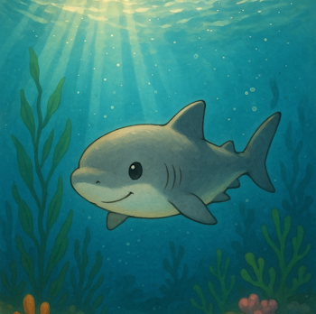

# 🦖 Refreryo's Revolution

  <h2 class="intro-title">Powerful Discord bots designed to enhance your server experience</h2>
  <h3 class="title">🦕 Let's get started! 🦖</h3>
  

    <a href="projects/" class="action-button primary-action" aria-label="Explore Projects">Explore Projects</a>
    <a href="changelogs/greendino-changelog/" class="action-button primary-action" aria-label="Newsletter">Newsletter</a>
    <a href="docs/getting-started/" class="action-button primary-action" aria-label="Get Started">Get Started</a>
  

  

    

      🐛
      Open Issues:
      -
    

    

      ⭐
      Stars:
      -
    

  

  

    💡 <strong>Pro Tip:</strong> Use the <b>Quick Links</b> below for fast access to support and documentation!
  

  

## Our Discord Bots

  

  <!-- Green Dino Card -->
    

      

        
      

      

        <h3>Green Dino</h3>
        
A comprehensive Discord bot with advanced features for large servers.

        
<strong>Version:</strong> 1.8.9

        <a href="projects/greendino/" class="bot-button" aria-label="Learn more about Green Dino">Learn more</a>
      

        

        <!-- Aviator Card -->
        

      

        
      

      

        <h3>Aviator</h3>
        
A bot for aviation and airport fans with lots of info and features.

        
<strong>Status:</strong> 1.0.0

        <a href="projects/aviator/" class="bot-button" aria-label="Learn more about Aviator">Learn more</a>
      

        

        <!-- Shark Byte Card -->  
        

      

        
      

      

        <h3 style="color:#03a9f4;">Shark Byte</h3>
        
Small moderation and fun bot, ideal for small to medium communities.

        
<strong>Status:</strong> 1.0.0

        <a href="projects/sharkbyte/" class="bot-button" aria-label="Learn more about Shark Byte">Learn more</a>
      

        

        <!-- ModMops Card -->
        

      

        🐶
      

      

        <h3>ModMops</h3>
        
Moderation &amp; Utility Bot

        
Please read the <a href="/refreryo-revolution.github.io/docs/faq/">FAQ</a> for this Bot.

        
<strong>Version:</strong> 0.2

        <a href="https://discord.com/oauth2/authorize?client_id=1383578297765462136" class="bot-button modmops-btn" aria-label="Invite ModMops">Invite</a>
      

        

        
  

## Key Features

  

    

      
📋

      <h4>Moderation Tools</h4>
      
Keep your server safe with powerful moderation commands.

    
    
    

      
🎮

      <h4>Fun Commands</h4>
      
Entertain your community with exciting games and activities.

    
    
    

      
⚙️

      <h4>Custom Configuration</h4>
      
Customize the bot to fit your server's needs.

    
    
    

      
📊

      <h4>Detailed Documentation</h4>
      
Comprehensive guides and command references.

    

  

## Quick Links

  

    <a href="support/" class="quick-link-button support" aria-label="Get Support">
      🛟 Get Support
    </a>
    <a href="docs/getting-started/" class="quick-link-button docs" aria-label="Documentation">
      📚 Getting Started
    </a>
    <a href="docs/faq/" class="quick-link-button" style="background-color:#388e3c;" aria-label="FAQ">
      ❓ FAQ
    </a>
  

## Connect With Us

  

    

      

        
      

      

        <h4>Discord</h4>
        
Join our community or message us directly!

        <a href="https://discord.gg/JA8VnRttNU" class="contact-link" aria-label="Join Discord">refreryo</a>
      

    

    

      

        
      

      

        <h4>GitHub</h4>
        
Report issues or help with development.

        <a href="https://github.com/Refreryo/refreryo-revolution/issues" class="contact-link" aria-label="Create GitHub Issue">Create Issue</a>
      

    

  

  

    
Released under the <a href="license/">MIT License</a> • © 2025 Refreryo

    

      🌐 <a href="#top" style="color:var(--primary-color);text-decoration:underline;">Back to top</a>
    

  

