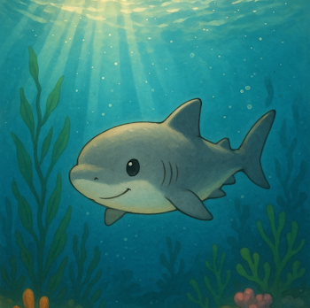

# Projects

  

    Explore our Discord bots designed to enhance your server experience
  

  

    

      
    

    

      <h3>Green Dino</h3>
      
A comprehensive Discord bot with advanced features for larger servers.

      
<strong>Version:</strong> 1.8.8

      <a href="greendino" class="bot-button">Learn More</a>
    

  

  
  

    

      
    

    

      <h3>Aviator</h3>
      
Mediumsize Bot for users who like to check airports and airplanes and more

      
<strong>Status:</strong> 1.0.0

      <a href="aviator" class="bot-button">Learn More</a>
    

  

<!--
  

    
🦕

    

      <h3>DinoByte</h3>
      
A small moderation and fun bot for Discord, perfect for small to medium communities.

      
<strong>Status:</strong> PAUSED

      <a href="dinobyte" class="bot-button">Learn More</a>
    

  

 
-->

      

      
    

    

      <h3 style="color:#03a9f4;">Shark Byte</h3>
      
A small moderation and fun bot for Discord, perfect for small to medium communities.

      
<strong>Status:</strong> 1.0.0

      <a href="sharkbyte" class="bot-button">Learn More</a>
    

  

      

        🐶
      

      

        <h3>ModMops</h3>
        
Moderation &amp; Utility Bot

        
<strong>Version:</strong> 0.2

        <a href="https://discord.com/oauth2/authorize?client_id=1383578297765462136" class="bot-button modmops-btn" aria-label="Invite ModMops">Invite</a>
      

        

        

--- 

## Getting Started

Want to try our bots? Check out the [setup guides](../docs/getting-started.md) to get started in minutes!

## Support

Having issues or questions? Visit our [support page](../support.md) for assistance.